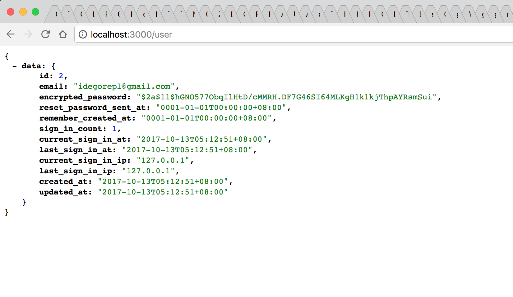

# A simple example of parsing Rails session in a Go API

The example shows how to read a Rails session from its cookie in a Golang API that's integrated in this same Rails application.

We use a Rails generator [go-on-rails](https://github.com/goonr/go-on-rails) to generate the application layout and most codes of the Go APIs in the example, and we mainly write the `contollers` part by ourselvies.

### Here we go

First, let's create a Rails app:

```bash
$ rails new example_read_rails_session --skip-bundle --database mysql
```

here we use the [Devise](https://github.com/plataformatec/devise/) to provide a session, so add `devise` to Gemfile, and don't forget add the gem go-on-rails as well:

```ruby
gem 'devise'
gem 'go-on-rails', '~> 0.3.1'
```

then run `bundle install`.

### Devise configuration

Let's config the Devise by its README doc. First run the generator:

```bash
$ rails generate devise:install
```

and next we create a model named `User` to Devise:

```bash
$ rails generate devise User
```

Then run `rails db:migrate` to create database tables.

### Create a Rails view page

Now we need to create a Rails view, a blank page will be ok.

```bash
$ rails g controller Pages home
```

Edit the `app/controllers/pages_controller.rb`, add a before_action to force a user authentication:

```ruby
class PagesController < ApplicationController
  before_action :authenticate_user!

  def home
  end
end
```

### Signup an user

Now let's set up the server by run `rails s`, then visit the url: http://localhost:3000/pages/home in your browser. It'll ask you so sign in, so you sign up an user with a email and password.

Bingo, we had finished the Rails part, let's create a Go API below.

### Generate the Go API

We use the [go-on-rails](https://github.com/goonr/go-on-rails) to generate a Go API for our testing to read a Rails session. go-on-rails is simple, we just run:

```bash
$ rails g gor development
```

here we use the `development` environment to generate a `go_app` directory in our Rails project root.

and don't forget to install Go packages our app depends on by running a predefined Rake task:

```bash
$ rails gor:deps
```

and we also need some other Go packages in this example, we can install them in advance:

```bash
go get github.com/bitly/go-simplejson
go get github.com/goonr/gorails/...
```

### Create a controller to read Rails session

Now we'll write an API to read Rails session. First let's create a contoller as `go_app/controllers/sessions_controller.go`.

And here we use a package [gorails](https://github.com/goonr/gorails) to read the session. Please check the [sessions_controller](https://github.com/goonr/example_read_rails_session/blob/master/go_app/controllers/sessions_controller.go) for the details.

After set a route in the `main.go`, we can set up our Go server to read the Rails session:

```bash
$ go run main.go -port 3000
```

Here our Go server run at port 3000 by default as same as Rails server, so now we visit the Go API, the browser'll send the previous Rails cookie back to Go server too. In realworld applications you maybe need some proxy server like Nginx to do the trick.

When we visit the http://localhost:3000/ , we can get a pretty printed JSON in my Chrome browser:


### Get and show an user's info

Let's create another API to get the user's ID, and use the ID to get the user's info and show it.

We create a `UserHandler` in our `sessions_controller.go`, and here we'll introduce a nice package [go-simplejson](https://github.com/bitly/go-simplejson) which can get an arbitrary node value to get the user's ID from our session data:

```go
/* ... */
jsn, _ := sj.NewJson(sessData)
uid, _ := jsn.Get("warden.user.user.key").GetIndex(0).GetIndex(0).Int64()
```

and then use `go-on-rails` generated function `FindUser` to get user's info:

```go
user, err := m.FindUser(uid)
/* ... */
```

we add a `GET /user` route for the API, and we can see such an output from browser:





The End.
